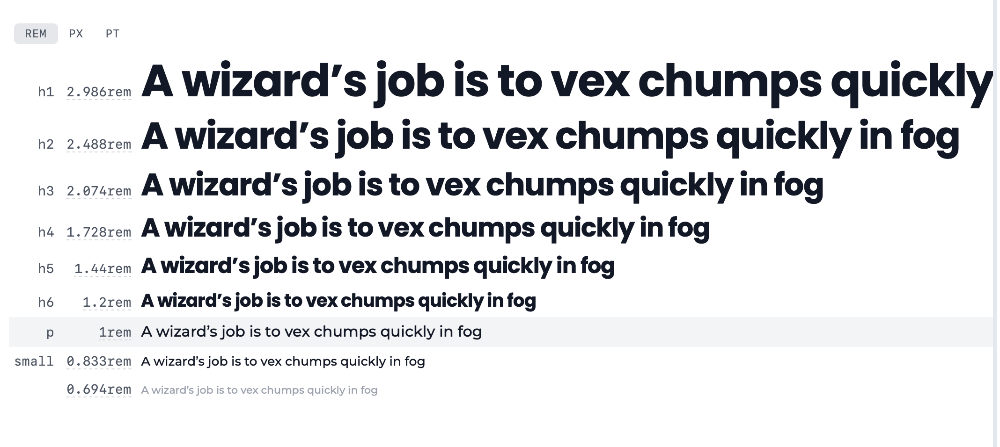

# Front End Capstone

## Overview

Our outdated client-facing retail web portal has become significantly outdated, negatively impacting sales. This project involves a complete redesign of the retail portal to modernize the site and improve customer experience. The initial release will focus on a minimum viable product (MVP) to allow customers to search, browse, add to cart, and checkout.

## Table of Contents

- [Front End Capstone](#front-end-capstone)
  - [Overview](#overview)
  - [Table of Contents](#table-of-contents)
  - [Description](#description)
  - [Installation](#installation)
  - [Usage](#usage)
  - [Requirements](#requirements)
    - [In Scope](#in-scope)
    - [Deferred to Future Release](#deferred-to-future-release)
  - [Constraints](#constraints)
  - [Quality Control and SLAs](#quality-control-and-slas)
  - [Design Decisions](#design-decisions)
    - [Company Name](#company-name)
    - [Logo](#logo)
    - [Typography](#typography)
    - [Color Palette](#color-palette)
  - [License](#license)

## Description

The Front End Capstone project is a modern e-commerce web application that uses the following technologies and frameworks:

- **Dependencies**: NPM, ES6 (server and client-side)
- **Transpilation**: Babel (via Webpack)
- **Linting**: Airbnb style guide
- **Asset Compilation and Loading**: Webpack, Webpack-dev
- **MVC Frameworks**: ReactJS, ExpressJS, Axios, Redux
- **CSS Libraries**: Sass, Styled Components
- **Testing**: Jest, React Testing Library
- **Deployment**: AWS, Docker

## Installation

To set up the project locally, follow these steps:

1. **Clone the repository**:

   ```bash
   git clone https://github.com/[yourusername]/fec-cache-up.git
   cd fec-cache-up
   ```

2. **Install dependencies**:

   ```bash
   npm install
   ```

3. **Configure environment variables**:

   Rename `example.env` to `.env` and add your necessary environment variables.

   ```env
    GITHUB_TOKEN='your_github_token'
    ```

4. **Transpile and bundle assets**:

   ```bash
   npm run build
   ```

5. **Run application**:

   ```bash
   npm start
   ```

## Usage

The application provides a seamless shopping experience with the following features:

- **Product Detail Page**: Displays product information, ratings, reviews, and related items.
- **Search and Browse**: Customers can search and browse through the product catalog.
- **Add to Cart and Checkout**: Users can select product styles and sizes, add them to the cart, and proceed to checkout.
- **Responsive Design**: The application is optimized for both mobile and desktop views.

## Requirements

The project will implement the following high-priority features:

- **Product Detail Module**: Displays product images, information, style selector, and add-to-cart functionality.
- **Ratings & Reviews Module**: Allows users to write and read reviews, with features like sorting and filtering.
- **Questions & Answers Module**: Users can ask and answer questions about products.
- **Related Items & Outfit Creation Module**: Displays related products and allows users to create outfits.

### In Scope

- Item Detail pages
- Homepage and Search page
- Checkout/Cart page

### Deferred to Future Release

- Performance Optimization
- Internal portals
- Catalog search improvements

## Constraints

- **Development Time**: 3 weeks
- **Team Size**: 3 developers
- **Technical Infrastructure**: Must utilize existing infrastructure without modifications
- **Accessibility**: Must comply with accessibility standards

## Quality Control and SLAs

- **Time to First Paint**: 0.8 seconds
- **Time to First Meaningful Paint**: 2.0 seconds
- **Time to Interactive**: 2.5 seconds

## Design Decisions

### Company Name

The new company name is **REPO**.

---

### Logo

The logo has been designed and approved.

<p align="left">
  
  
</p>

---

### Typography

The typography for the brand has been selected.

- **Title Font**: [Poppins](https://fonts.google.com/specimen/Poppins)
- **Primary Font**: [Montserrat](https://fonts.google.com/specimen/Montserrat)
- **Type Scale**: [Type Scale](https://typescale.com/board/46055288e5/)

<p align="left">
  
</p>

---

### Color Palette

[Color Palette](https://coolors.co/palette/222222-666666-596b80-ab1b38-f2eded-ffffff)
[Dark Theme Mockup](https://www.realtimecolors.com/?colors=dedede-000000-7e90a5-999999-e45370&fonts=Poppins-Montserrat)
[Light Theme Mockup](https://www.realtimecolors.com/?colors=212121-ffffff-5a6c81-666666-ac1b38&fonts=Poppins-Montserrat)

<p align="left">
  
</p>

---

## License

This project is licensed under the MIT License - see the [LICENSE](LICENSE) file for details.
